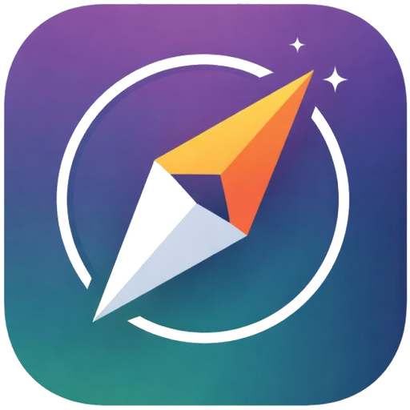
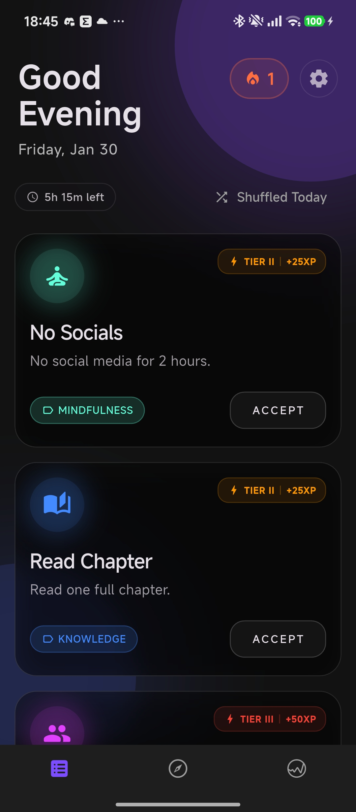
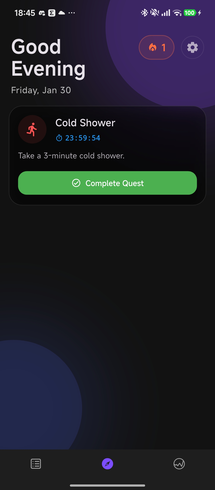
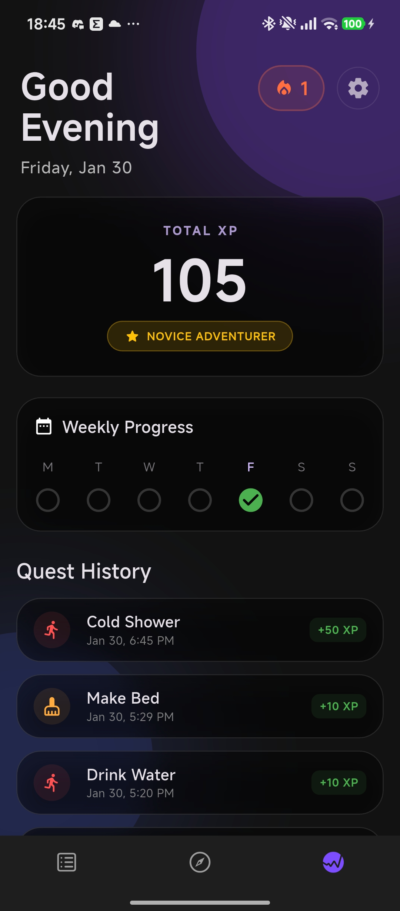

  

  <h1 align="center">⚔️ Sidequest</h1>

  

    Your daily chores, gamified.
  

> **"Turn your daily chores into an epic adventure."**

**Sidequest** is a gamified productivity app built with **Flutter**. It transforms mundane daily tasks into RPG-style "contracts," rewarding users with XP, streaks, and rank progression. Designed with a sleek, dark **Glassmorphism UI** inspired by dark fantasy games (The Witcher), it helps users build habits in Fitness, Knowledge, Mindfulness, and Creativity.

---

## 🛡️ Key Features

* **🎲 Random Quest Generation:** Daily "contracts" generated across various categories (Fitness, Social, Chore, Knowledge).
* **💎 Gamification System:** Earn **XP** for completing tasks, level up your rank (Novice → Wanderer → Slayer), and maintain your daily **Fire Streak**.
* **✨ Glassmorphism Design:** A modern, dark-themed UI with frosted glass effects, ambient gradients, and smooth animations.
* **🔀 Shuffle Mechanic:** Don't like your quests? Use the "Shuffle" button (limited to once per day) to get new contracts.
* **💤 Tavern Rest (Vacation Mode):** Going away? Pause your streak without losing progress.
* **🔔 Daily Summons:** Local notifications ("Daily Summons" & "Last Call") with randomized RPG-themed messages to keep you engaged.
* **💾 Offline First:** Built with **Hive** (NoSQL database) for persistent local storage. No internet required.

---

## 🔮 Future Roadmap

* [ ] Custom Quest Creation
* [ ] Achievement Badges
* [ ] Sound Effects & Haptics expansion
* [ ] Widget for Home Screen

---

## 📄 License

This project is open source and available under the [MIT License](LICENSE).

---

*Built with ❤️ and ☕ by Jusťák*

